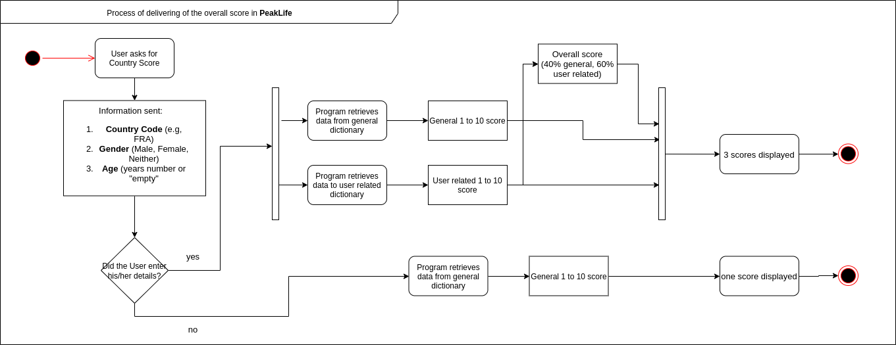

## On the Structure
* `docs` contains the two main diagrams that describe the functioning of the app.
* `src` contains the following:
    - Django infrastructure
    - Algorithm and API retrieval tools
    - Test script for algorithm
    
* the functioning of the app and the algorithm are represented respectively in the two diagrams below:




## Setup
* Have Python 3 installed
* Download and run PyCharm Education
* Select `Check out from Version Control` > `Git` > enter your project GitLab project URL
* `Would you like to open the directory?` > `Yes`
* A couple of configurations once you're inside:
    * Go to `File` > `Settings` > `Tools` > `Python Integrated Tools` and change the default test runner to be `pytest`

## Running
Run in the PyCharm terminal following command `python src/manage.py runserver`. Click the link to be redirected to the PeakLife app.

## Testing

The script `test.py` provides a full analysis of the script used for the determination of the scores provided in PeakLife. The interested script is `algorithm.py`, located in the `indicators` folder.

The script is suitable for three different type of tests:
- unit tests
- code and branch coverage
- format quality

### Unit Test

To run all tests, right-click on the `src/test` folder and select
 `Run 'pytest in test'`. To run an individual test, click on the green 
 play button next to it.

You can also do the same through the terminal (open it in PyCharm by clicking on `Terminal` in the lower toolbar - you may have to click on the icon in the bottom-left corner to reveal it):

```
pytest src
```

### Coverage
- In the terminal run 
``` 
coverage run --source <indicators folder path> <test.py path>
```

- Run `coverage html` to see the results

The output goes into the `htmlcov` directory. You can view your coverage report by right-clicking on the `index.html` file in that directory and selecting `Open in Browser`!

## Pylint
A format overview of the code is automatically generated when running `test.py`
